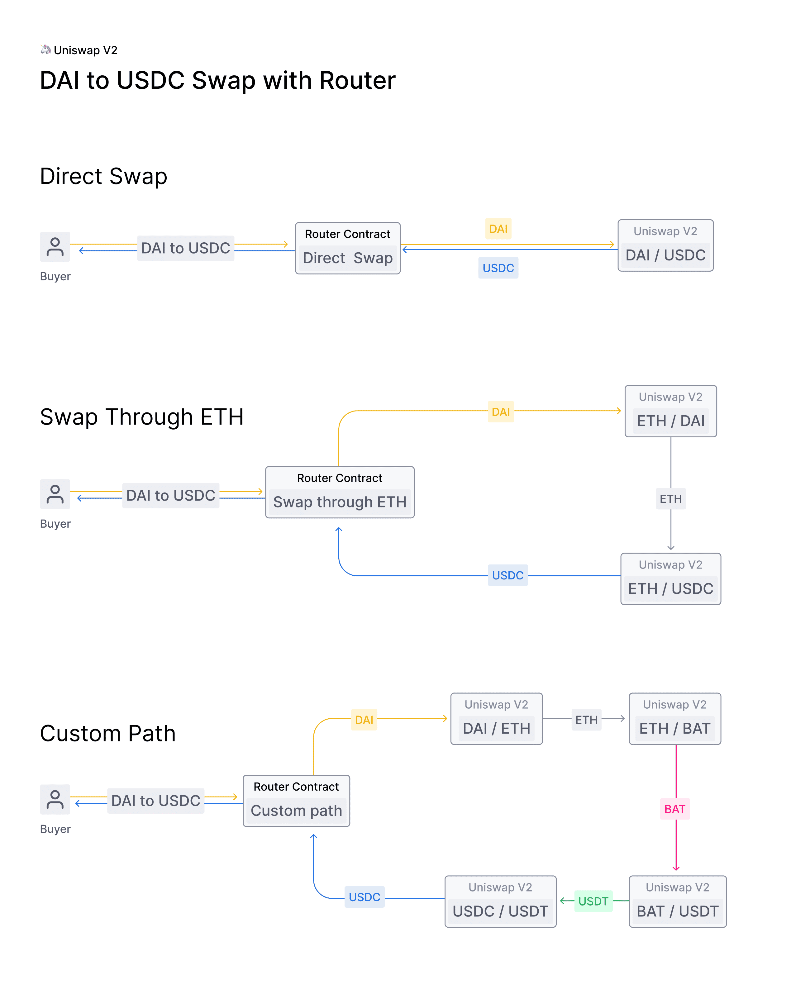

# Swap ERC20 on Uniswap-V2

## Background:

- Uniswap V2 is an upgrade on V1

- Uniswap V2 provides ERC20 to ERC20 token swaps, where ETH is no longer required
  to be an intermediary token to facilitate the swap process.

- This was also known as “ETH bridging”.
  Removing this requirement cuts the transaction count in half and saves on gas fees.

- This also allows Dapps to effectively find “routes” from one token to another
   in the event that there is not a pool set up for a direct token swap.
 

### Usecase-1 - DAI to USDC Swap with Router:

 - Step-1: Approve spending on DAI Token wallet for UniSwap-V2 Router

   - https://ropsten.etherscan.io/address/0x7a250d5630b4cf539739df2c5dacb4c659f2488d#code

   - UniswapV2Router02: 0x7a250d5630b4cf539739df2c5dacb4c659f2488d

 - Step-2: Swap DAI Token for another ERC20 Token [Done via UniSwap-Router]

 

### Usecase-2 - Personal Token to USDC Swap with Router:

 - Step-1: Approve spending on Personal Token from wallet

 - Step-2: Create a pair on Uniswap-V2 (Add Liquidity will automatically create a Pair)

 - Step-3: Swap Personal Token for another ERC20 Token [Done via UniSwap-Router]


## Usecase-2 Steps:

1. Approve spending on Lakshmikanth tokens for UniSwapRouterV02

   ```shell
     node commands/ApproveTokenSpendingCommand.js --tokens=100
   ```

   - Terminal Log:

   ```
    completed Spending-Approval of 100 - with transactionHash: 0x4286e8346131240223b7d81ad8f55c52dfc8e770aa11ee0481714a9815d83059
   ```

   - Etherscan: https://ropsten.etherscan.io/tx/0x4286e8346131240223b7d81ad8f55c52dfc8e770aa11ee0481714a9815d83059

   - Function call log:

    - Event Emitted from AddLiquidity Function Call:

      |#|	Name |	Type |	Data|
      | --- | --- |--- |--- |
      |0|	_spender|	address| 0x7a250d5630B4cF539739dF2C5dAcb4c659F2488D |
      |1|	_value   |	uint256| 100000000000000000000|


2. Add LiquidityToETH for UniSwapRouterV02

 - Command to be executed on terminal

  ```shell
  node commands/AddLiquidityToUniswapRouterV2Command.js --amountTokenDesired=10000000000 --amountTokenMin=5000000000 --amountETHMin=1000000000
  ```

- Terminal command Log:

  ```
  completed adding-LiquidityETH of 1000000000 - with transactionHash: 0xe1acfa7e776f1d24fa048c814743505a9583b251164e460798c8ff682be22044
  ```

 - Etherscan:

 - Function Log from Etherscan:

